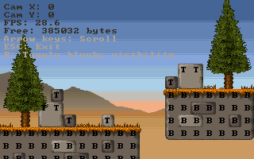
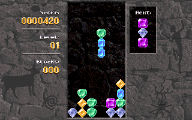

# DOS Game Engine

A retro DOS multimedia engine written in **Turbo Pascal 7.0** (1994-era), featuring VGA Mode 13h graphics, AdLib/OPL2 music, and Sound Blaster digital audio. Perfect for demoscene-style programming, retro game development, and learning classic DOS systems programming.


## 📸 Screenshots

<div align="center">
  <table>
    <tr>
      <td align="center">
        <a href="DOCS/SCREENS/TMXTEST.png">
          
        </a>
        <br>
        <strong>Tilemap Rendering</strong><br>
        <small>TMXTEST.PAS</small>
      </td>
      <td align="center">
        <a href="DOCS/SCREENS/XICLONE.png">
          
        </a>
        <br>
        <strong>Example Game</strong><br>
        <small>XICLONE.PAS</small>
      </td>
    </tr>
    <tr>
      <td align="center">
        <a href="DOCS/SCREENS/SPRTEST.png">
          
        </a>
        <br>
        <strong>Sprite Animation</strong><br>
        <small>SPRTEST.PAS</small>
      </td>
      <td align="center">
        <a href="DOCS/SCREENS/SETUP.png">
          
        </a>
        <br>
        <strong>Setup Utility</strong><br>
        <small>SETUP.PAS</small>
      </td>
    </tr>
  </table>
</div>

## 🚀 Quick Start

### Prerequisites
- [Turbo Pascal 7.0](https://winworldpc.com/product/turbo-pascal/7x) (TPC.EXE in %PATH%)
- [DOSBox-X](https://dosbox-x.com/), [86Box](https://86box.net/) or real DOS/FreeDOS
- HIMEM.SYS loaded (for XMS extended memory support, default in DOSBox)

### First Run
```bash
# Compile & try the example game (WIP)
cd ..\XICLONE
CXICLONE.BAT
XICLONE.EXE
```

**Controls:**
- **Left/Right**: Move the stack left and right
- **Down**: Falling faster
- **Space**: Rotate stack
- **ESC**: Pause

## ✨ Features

### 🎨 Graphics
- 320×200 VGA Mode 13h with double-buffering
- Variable-width bitmap fonts (PCX + XML)
- UI widget toolkit (buttons, labels, checkboxes, line edits)
- PCX/BMP image loading (Aseprite, GIMP compatible)
- TMX tilemap support (Tiled Map Editor)
- Delta-time sprite animation system
- Dirty rectangle optimization

### 🔊 Audio
- HSC music (AdLib/OPL2, interrupt-driven)
- XMS-based sound bank (VOC format, 8-bit PCM)
- Sound Blaster DSP driver (DMA-safe mixing)

### 🎮 Input
- Hardware keyboard handler (INT 9h)
- Mouse support (INT 33h, 3-button)

### 🧠 Memory & Performance
- XMS extended memory manager (>1MB RAM)
- RTC high-resolution timer (IRQ8, no HSC conflict)
- Dirty rectangle rendering

### 📦 Resources
- XML-based resource manager (lazy/eager loading)
- Unified game loop framework
- Lightweight XML parser/writer
- INI configuration system
- String hash map (O(1) lookup)
- Linked list utilities

### 🛠 Tools
- Sound card setup utility
- Text-mode UI toolkit
- Debug logger (startup/shutdown safe)
- Comprehensive test suite

## 📚 Documentation

### Core Graphics
- **[VGA.PAS](DOCS/VGA.md)** - Mode 13h graphics driver (320×200, 256 colors)
- **[PCX.PAS](DOCS/PCX.md)** - PCX image loader/saver
- **[BMP.PAS](DOCS/BMP.md)** - Windows BMP image loader/saver
- **[VGAPRINT.PAS](DOCS/VGAPRINT.md)** - Embedded 8×8 bitmap font
- **[VGAFONT.PAS](DOCS/VGAFONT.md)** - Variable-width font system
- **[SPRITE.PAS](DOCS/SPRITE.md)** - Delta-time sprite animation
- **[DRECT.PAS](DOCS/DRECT.md)** - Dirty rectangle optimization

### User Interface
- **[VGAUI.PAS](DOCS/VGAUI.md)** - VGA widget toolkit (buttons, labels, checkboxes, line edits)
- **[TEXTUI.PAS](DOCS/TEXTUI.md)** - Text mode UI system (SETUP utility)

### Audio
- **[SBDSP.PAS](DOCS/SBDSP.md)** - Sound Blaster DSP driver
- **[SNDBANK.PAS](DOCS/SNDBANK.md)** - XMS sound bank manager
- **[PLAYHSC.PAS](DOCS/PLAYHSC.md)** - HSC music player (AdLib/OPL2)
- **[HSC Format](DOCS/HSC.md)** - HSC file format specification

### Input
- **[KEYBOARD.PAS](DOCS/KEYBOARD.md)** - Hardware keyboard handler (INT 9h)
- **[MOUSE.PAS](DOCS/MOUSE.md)** - Mouse driver (INT 33h)

### Tilemaps
- **[TMXLOAD.PAS](DOCS/TILEMAP.md)** - TMX tilemap loader (Tiled Map Editor)
- **[TMXDRAW.PAS](DOCS/TILEMAP.md)** - TMX rendering system

### Memory & Timing
- **[XMS.PAS](DOCS/XMS.md)** - Extended memory manager (HIMEM.SYS)
- **[RTCTIMER.PAS](DOCS/RTCTIMER.md)** - RTC high-resolution timer (IRQ8)

### Resources
- **[RESMAN.PAS](DOCS/RESMAN.md)** - XML-based resource manager
- **[MINIXML.PAS](DOCS/MINIXML.md)** - Lightweight XML parser/writer
- **[CONFIG.PAS](DOCS/CONFIG.md)** - INI configuration system

### Utilities
- **[GENTYPES.PAS](DOCS/GENTYPES.md)** - Generic pointer and array types
- **[STRUTIL.PAS](DOCS/STRUTIL.md)** - String conversion utilities
- **[STRMAP.PAS](DOCS/STRMAP.md)** - String hash map (O(1) lookup)
- **[LINKLIST.PAS](DOCS/LINKLIST.md)** - Doubly-linked list
- **[LOGGER.PAS](DOCS/LOGGER.md)** - Debug file logger

### Game Framework
- **[GAMEUNIT.PAS](DOCS/GAMEUNIT.md)** - Unified game loop and screen management

### Guides
- **[Build Guide](DOCS/BUILD.md)** - Compilation instructions
- **[Asset Creation](DOCS/CREATE.md)** - Creating PCX, VOC, HSC, TMX assets
- **[Example Program](DOCS/EXAMPLE.md)** - Complete game example walkthrough

## 📁 Project Structure

```
D:\ENGINE\
├── DOCS\           Documentation and design notes
├── TESTS\          Test programs (IMGTEST, TMXTEST, SPRTEST, FNTTEST, etc.)
├── SETUP\          Sound card setup utility
├── UNITS\          Core engine units (VGA, SBDSP, Keyboard, Mouse, XML, Sprite, etc.)
├── VENDOR\         Third-party libraries (SBDSP, XMS, HSC)
└── XICLONE\        Example game (Columns/Xixit clone, WIP)
```

## 🎨 Creating Assets

**PCX Images:**
- **Aseprite** (recommended): File → Export → .pcx (8-bit indexed color mode)
- **GrafX2** (good palette handling): File → Save → .pcx
- **GIMP**: Image → Mode → Indexed (256 colors) → Export as PCX
- **Photoshop**: Image → Mode → Indexed Color → Save As PCX (8 bits/pixel)
- Common sizes: 320×200 (full screen), 32×32 (sprites), 16×16 (tiles)

**VOC Sounds:**
Use [Audacity](https://www.audacityteam.org/) → Mix to Mono → Resample 11025Hz → Export as VOC (Unsigned 8-bit PCM).

**HSC Music:**
Use [Adlib Tracker II](https://adlibtracker.net/) or [HSC-tracker](https://demozoo.org/productions/293837/).

**TMX Tilemaps:**
Use [Tiled](https://www.mapeditor.org/) (see [TILEMAP.md](DOCS/TILEMAP.md) for restrictions).

## 📜 Credits

- **SBDSP**: Romesh Prakashpalan (1995)
- **XMS Driver**: KIV without Co (1992)
- **HSC Player**: Glamorous Ray (1994)

## 🤝 Contributing

Contributions welcome! This engine preserves 1990s DOS demoscene techniques while remaining hackable and educational.

## 🔒 Asset Licensing

Some `DATA` files (images and tilesets) are © 2025 Dynart Kft. Free for non-commercial use with credits. Commercial use requires separate license. See `ASSETS_LICENSE.md`.

---

**Made with 💾 for retro DOS enthusiasts**
